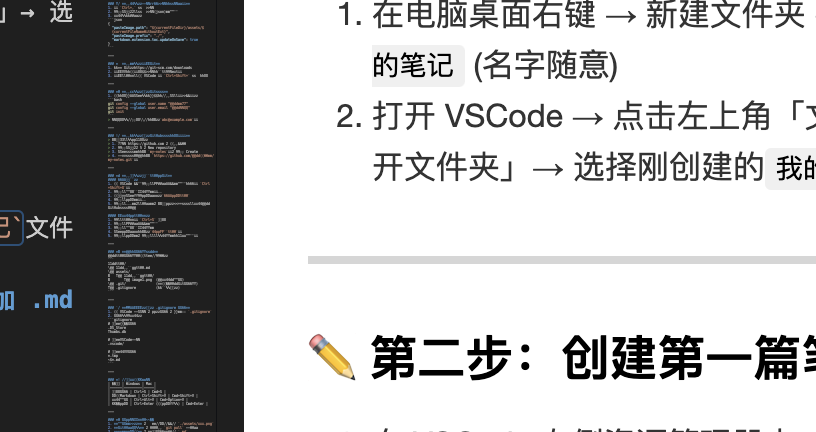

---

### 📝 **第一步：创建笔记文件夹**
1. 在电脑桌面右键 → 新建文件夹 → 命名为 `我的笔记` (名字随意)
2. 打开 VSCode → 点击左上角「文件」→「打开文件夹」→ 选择刚创建的`我的笔记`文件夹

---

### ✏️ **第二步：创建第一篇笔记**
1. 在 VSCode 左侧资源管理器中 → 右键点击`我的笔记`文件夹 → 选择「新建文件」
2. 输入文件名：`我的第一篇笔记.md` (注意：**必须加 .md 后缀**)
3. 在文件中输入以下内容：
```markdown
# 我的学习笔记
> 创建日期：2025-08-03

## 今日学习内容
1. 安装了VSCode
2. 学会了创建Markdown文件
3. 学会了写基础格式：
   - **粗体文字**
   - *斜体文字*
   - [这是一个链接](https://example.com)

## 明日计划
- [ ] 学习Git上传
- [ ] 整理笔记目录
```

---

### 🖼️ **第三步：安装必备插件**
1. 点击左侧边栏的「扩展」图标（或按 `Ctrl+Shift+X`）
2. 搜索安装以下插件：
   - `Markdown All in One` (作者：Yu Zhang)
   - `Paste Image` (作者：mushan)
   - `Markdown Preview Enhanced` (作者：Yiyi Wang)
   - `GitLens` (作者：GitKraken)

> 安装后可能需要重启 VSCode

---

### 🌈 **第四步：预览笔记 & 粘贴图片**
1. **预览笔记**：
   - 打开你的 `.md` 文件
   - 按 `Ctrl+Shift+V` → 右侧会出现预览窗口
   - 右上角点击「拆分视图」图标，可以边写边看

2. **粘贴图片**：
   - 用微信/QQ截图工具截一张图 → 复制到剪贴板
   - 在笔记中按 `Ctrl+Alt+V` (Windows) 或 `Cmd+Option+V` (Mac)
   - 图片会自动保存到 `assets/笔记名/` 文件夹
   - 你会看到自动生成的图片链接：``

---

### ⚙️ **第五步：配置插件设置（关键！）**
1. 按 `Ctrl+,` 打开设置
2. 点击右上角「打开设置(json)」图标
3. 粘贴以下代码：
```json
{
  "pasteImage.path": "${currentFileDir}/assets/${currentFileNameWithoutExt}",
  "pasteImage.prefix": "./",
  "markdown.extension.toc.updateOnSave": true
}
```

---

### 🚀 **第六步：安装Git**
1. 下载 Git：https://git-scm.com/downloads
2. 安装时全部选默认设置（一直点Next）
3. 安装完成后，在 VSCode 按 `Ctrl+Shift+` 打开终端

---

### 🔐 **第七步：创建Git仓库**
1. 在终端依次输入以下命令（每行输完按回车）：
```bash
git config --global user.name "你的名字"
git config --global user.email "你的邮箱"
git init
```
> 邮箱可以是任意格式（如：`abc@example.com`）

---

### ☁️ **第八步：创建GitHub仓库（可选）**
> 如果想同步到云端：
> 1. 访问 https://github.com → 注册账号
> 2. 点击右上角 ➕ → New repository
> 3. 输入仓库名（如 `my-notes`）→ 点击 Create
> 4. 复制仓库地址（如 `https://github.com/你的用户名/my-notes.git`）

---

### 📤 **第九步：上传笔记到Git**
#### 首次上传：
1. 在 VSCode 左侧点击「源代码管理」图标（或按 `Ctrl+Shift+G`）
2. 点击「暂存所有更改」按钮
3. 在上方输入框写提交信息：`首次提交笔记`
4. 点击「提交」按钮
5. 点击「...」→「推送」→ 如果提示远程仓库，粘贴你的GitHub仓库地址

#### 日常更新笔记后：
1. 写完笔记后按 `Ctrl+S` 保存
2. 点击「源代码管理」图标
3. 点击「暂存所有更改」
4. 输入提交信息（如：`更新学习笔记`）
5. 点击「提交」→ 点击「同步更改」（云朵图标）

---

### 📂 **最终文件夹结构**
你的笔记文件夹现在应该是这样：
```
我的笔记/
├── 我的第一篇笔记.md
├── assets/
│   └── 我的第一篇笔记/
│       └── image1.png  (你粘贴的图片)
├── .git/               (自动生成的Git文件夹)
└── .gitignore          (下一步创建)
```

---

### ⚠️ **重要补充：创建 .gitignore 文件**
1. 在 VSCode 中右键 → 新建文件 → 命名为 `.gitignore`
2. 文件内容粘贴：
```gitignore
# 忽略系统文件
.DS_Store
Thumbs.db

# 忽略VSCode配置
.vscode/

# 忽略临时文件
*.tmp
~$*.md
```

---

### 💡 小白常用快捷键
| 功能 | Windows | Mac |
|------|---------|-----|
| 保存文件 | Ctrl+S | Cmd+S |
| 预览Markdown | Ctrl+Shift+V | Cmd+Shift+V |
| 粘贴图片 | Ctrl+Alt+V | Cmd+Option+V |
| 快速提交 | Ctrl+Enter (在提交框内) | Cmd+Enter |

---

### 🚨 遇到问题怎么办？
1. **图片不显示** → 检查路径是否是 `./assets/xxx.png`
2. **Git推送失败** → 先运行 `git pull` 再推送
3. **看不到预览** → 确保文件后缀是 `.md`
4. **插件不生效** → 重启 VSCode


---
## 第五步的作用
---

> 建议第一次操作时截屏记录每个步骤，有任何卡住的地方随时问我，我可以提供更具体的截图指导！ 😊

你问的这一步（配置插件设置）是解决 **Markdown 笔记图片管理**和 **目录自动更新** 的核心操作，它的作用我拆解如下：

---


### 🖼️ 一、图片粘贴配置（解决 Git 同步图片的关键）
```json
"pasteImage.path": "${currentFileDir}/assets/${currentFileNameWithoutExt}",
"pasteImage.prefix": "./",
```
#### 作用解释：
1. **智能创建图片文件夹**  
   当你用 `Ctrl+Alt+V` 粘贴截图时：  
   - 自动在 **当前笔记所在目录** 下创建 `assets` 文件夹  
   - 在 `assets` 内再创建 **和笔记同名的文件夹**（比如笔记叫 `学习笔记.md`，就创建 `学习笔记/`）  
   - 图片保存为 `image1.png`、`image2.png`...

   ✅ 效果示例：  
   `你的笔记/`  
   ├── 学习笔记.md  
   └── assets/  
       └── 学习笔记/  ← **自动创建！**  
           └── image1.png  

2. **生成 Git 友好的图片路径**  
   - 笔记中插入的图片链接会是：``  
   - 开头的 `./` 表示 **当前目录**（Git 同步后在任何电脑都能正确加载图片）

#### 为什么重要？
> 💡 如果没有这个配置，默认可能生成**绝对路径**（如 `C:\Users\xxx\image.png`），这种路径：  
> - 上传 Git 后别人看不到图片  
> - 换电脑后你自己也打不开  
> - 会污染 Git 仓库

---

### 📑 二、目录自动更新配置
```json
"markdown.extension.toc.updateOnSave": true
```
#### 作用解释：
1. **自动维护笔记目录**  
   当你在笔记中用 `[toc]` 生成目录后：  
   ```markdown
   ## 目录
   [toc]  <!-- 这里会自动生成目录 -->
   
   ## 第一章
   ### 第一节
   ```
   - 每次保存笔记（`Ctrl+S`）时，目录会**自动刷新**  
   - 新增/删除章节标题后无需手动更新目录

#### 为什么重要？
> 💡 手动维护长笔记目录极其耗时，此配置确保你的目录永远和最新内容同步

---

### 🌰 举个实际场景
假设你正在写《Python学习笔记.md》：
1. 复制一张代码截图 → 按 `Ctrl+Alt+V`  
   → 自动保存到 `你的笔记/assets/Python学习笔记/code1.png`  
   → 笔记中插入 ``
2. 新增章节标题 `## 列表操作` 后按 `Ctrl+S`  
   → 目录自动把新章节加入

---

### ⚠️ 不配置的后果
| 问题 | 是否解决 |
|------|----------|
| 图片路径混乱（换电脑打不开） | ✅ 已解决 |
| Git 仓库图片无法显示 | ✅ 已解决 |
| 每次修改标题需手动更新目录 | ✅ 已解决 |  
| 图片文件散落各处难管理 | ✅ 已解决 |

---

### 📌 总结来说，这步配置是为了：
1. **让图片存储井井有条**  
2. **保证 Git 同步后图片正常显示**  
3. **彻底解放双手——目录自动维护**  

如果操作中遇到问题，随时告诉我你的具体卡点（比如粘贴图片后路径显示不对），我会手把手帮你调整！ 😊